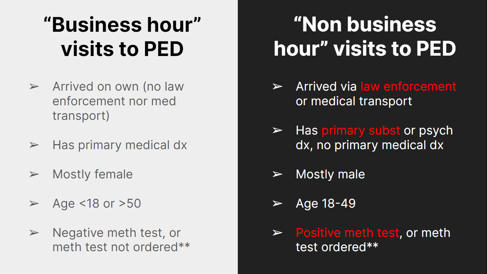

`---
layout: essay
type: essay
title: "314: The end of an era"
# All dates must be YYYY-MM-DD format!
date: 2024-05-10
published: true
labels:
  - 314
  - Software
  - Agile
  - Project
  - Design
---

# Reflection of classes 

I am not lying when I say that this was one of the most practical ICS classes I have taken, as my sophomore year of college comes to a close. My previous ICS classes, ranging from discrete math to algorithms, were good classes too, but I’ve always felt a little bothered by how they were’t very practical. For example, in discrete math, we’d be learning a lot of theoretical concepts, such as basic computational theory, graph theory, and propositional logic. While there would be real world examples scattered throughout the lectures, they were’t always as applicable (e.g. I would never see myself using Prim’s algorithm of tree traversal unless I worked as a senior software developer for Google Maps). The Intro to Computer Science classes were a little more practical as I got into writing Java code, however I could never see my programs in action as the outputs would mostly be printed to the terminal. These prerequisite classes were for beginners, designed to build a solid foundation in CS to tackle more advanced classes like 314, so it was somewhat understandable that I would’t be doing much real-world projects. 

Thus, learning about the entire software development process in 314 was such a game changer. Software engineering was so much better than learning about theoretical computer science concepts, as it was much more involved with hand-on projects. I learned many things as part of SWE, such as the Meteor.js web stack. Aside from the web stack, I also learned a lot of concepts that weren’t as related to coding, such as quality assurance, UI design / design patterns, coding standards, and agile project management. These concepts are applicable to outside software engineering as well. 

# Design Patterns 

Design patterns are evident everywhere outside of software. The [essay that I wrote on design patterns](link) showcases the striking differences between Chrome and Edge’s UI. It is evident that the developers or UI/UX designers followed completely different design patterns when creating. Not much detail is presented in this essay, but in the essay I talked about how Chrome’s UI was better sectioned off and had more generous whitespace, making it much easier to navigate. Outside of browsers or other web-related projects, design patterns can help with other digital media. For example, there are unwritten sets of rules on what not to do on your PowerPoint presentation. Some rules may include:

1. No fonts below X size. '
2. Place images and other visuals on slides, the fewer words the better. 
3. When placing words, use bullet points with a maximum of X number of words on each point. Anything more than that will be tiring on the eyes. 
4. No paragraphs, unless you absolutely have to. 
5. No distracting fonts. 

These rules all fall under design patterns, and are not limited to PowerPoint presentations. Instagram posts / reels and posters/flyers also follow very similar design patterns, all involving font size, color, and readability. In my personal experience, I have seen a few Instagram reels that violate some of these rules, and it somewhat leaves me disappointed as these reels are supposed to advertise certain events happening on campus. For example, a reel that is supposed to advertise a run club event had one of the smallest font sizes possible, with the important information (e.g. time, date, distance) un-highlighted. Thus, design patterns can indeed spill over into other graphical media aside from software engineering.


A good powerpoint slide, adhering to design patterns.
<br><br>


A worse powerpoint slide, bending a few design patterns.
<br><br>

# Agile project management 

Prior to this class, I did not know what agile project management was. However, after setting up the GitHub project board, creating project to-dos, and assigning each person on my team a to-do via the project board, I kind of got a taste of what agile development is, and I enjoyed it. When I got mixed up on which team member was doing what, I could simply check the GitHub project board, and I would be up-to-date. This also made communication between team members much easier, as I could reference what was on the project board. For example, 

```Hey X, I saw that you’re doing issue Y on GitHub project board. I was wondering if you can integrate the <contents of issue Y> with my current updates when you have a chance?```

Similar to design patterns, agile project development can be applied to other projects, such as collaborating online on PowerPoint. It could be as simple as creating a group presentation and assigning each person to do something, yet it’s very effective.