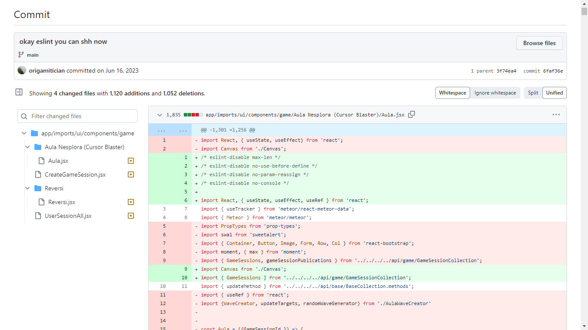

I was somewhat aware of the existence of Bootstrap prior to this class; I knew that it was a library with a bunch of CSS classes that allow organization of elements on a website in a clean, visually appealing format. I’ve never coded with it before prior to this class (no pun intended); however, so I just thought it was a convenient, easy to use library that I never was interested in. Being someone who liked to have control over my code, I liked creating custom CSS and creating layouts from scratch. This is where Bootstrap and I clash, unfortunately.

### Bootstrap is Responsive…

Before I discuss my personal love-hate relationship with it, I believe that Bootstrap and other UI frameworks are very important. In an era where different types of devices are used to access the Internet (e.g. phones, TVs, or even game consoles), website responsiveness is a huge deal. Without a responsive layout, a website that looks okay on one device may be completely messy on another device and unreadable. For example, take my very first website that was completely unresponsive. I used custom CSS to style the elements by pixel (cringe, but I didn’t know any better at the time), so a bunch of my CSS properties had something like `margin-left: 30px` or `width: 1200px`. Take a look below.

<image> <image>
These UI frameworks alleviate this issue by providing a lot of simplified code that takes into account many different viewport sizes and dimensions. For example, there are breakpoints in bootstrap, such as `sm` or `lg`, which determine at which screen widths these elements transform into a readable format. On top of that, a lot of the commonly used elements that are used in Bootstrap can be made responsive by simply adding a class name (such as navbars or tables). Therefore, in terms of convenience and code conciseness, Bootstrap simply can’t be beat. If custom CSS were to be used instead of Bootstrap, our CSS files would be filled with different media queries, each of which holding hundreds or even thousands of lines of custom CSS that was designed for that particular screen size. I have experienced this frustration firsthand, as I would write hundreds of lines of CSS for my websites specifically for widescreen devices like my laptop. Then, I’d have to write another hundred lines of code for portrait devices.
**TL;DR: **As more varieties of devices can access the Internet, tools like Bootstrap that can make a website responsive for all dimensions with just a few classes are extremely convenient, and the speed of which this is developed cannot be beat. 

### …actually, Bootstrap is not responsive in all ways. It’s not responsive towards my itch for code control.

Much of my satisfaction from coding comes from the physical action of typing out code on my keyboard and seeing the results come out, such as creating a navbar or a line graph from scratch. This is because I get to fine-tune the tiniest things to my own liking, and it gives me a sense of ownership and control over my project. Thus, I’m not really a fan of libraries / frameworks that offer templates or easy-to-use development tools, as I feel like I’m injecting some code that other people wrote for me, and the templates feel extremely restricting. The action of copying and pasting template code and slapping a few pre-made classes does not feel exciting nor natural to me.

Bootstrap seems to have this problem. I have a feeling that most of my “Bootstrap hate” is fueled by how it was introduced in class – we had to create a mockup of a website purely with Bootstrap, and if I remember correctly, we had to keep custom CSS to a minimum. This lead me to get stuck with the limited options Bootstrap offered for padding, margins, column size, flexbox layout, and a whole slew of other CSS properties. I was not enjoying this process at all and felt like I could have arrived at a much better and enjoyable result using custom CSS entirely. For example, sticking the website logo, menu options, and search bar inside a nav was a nightmare in terms of sizing, and could have been avoided using a flexbox and customizing the width of each element. 

### Bootstrap for extremely complicated and tedious things, and custom CSS for simple things is the sweet spot.

I still have a spot for Bootstrap in my heart because it gets things done. As I was reading the documentation, it seems like it can achieve a lot of complicated things, such as complicated multi-level navbars that would otherwise be a nightmare to code using custom HTML and CSS. Furthermore, its responsiveness would be a huge timesaver as I would not have to deal with media queries on complicated HTML. However, for something as simple as text over an image or well as a single-layered navbar, I believe that I can achieve much better results with custom CSS. Thus, as I continue to build different web applications, I intend to use Bootstrap for the “crucial” parts such as sign-in pages, footers, and headers, and custom CSS for website content. That way, I still have control over some aspects of my code while still maintaining website responsiveness. On top of that, custom CSS would stand out when compared to other websites that were purely made with Bootstrap.

Perhaps I’ll just need to get used to it. Maybe I’ll look back on this essay two years later and think “Ah, I remember the time I didn’t really care for Bootstrap as much. Now I love it and I can’t live without it.” But only time will tell.

 
ESLint fixing hell during internship. Close to 3000 insertions + deletions in a single commit!  
