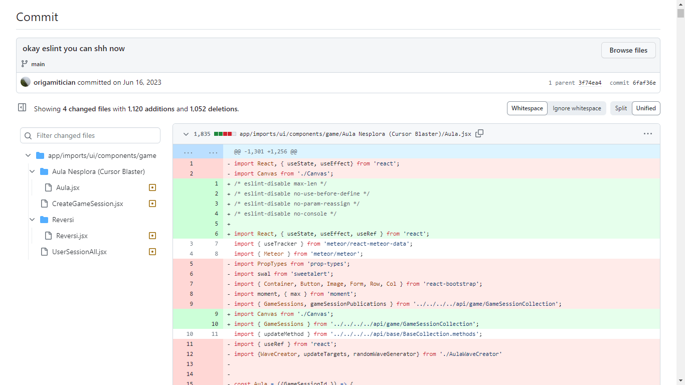

### My experiences (dreadful)
I was first introduced to the ESlint JavaScript coding standards during my summer internship at the Hawaii Digital Health Lab. The GitHub repository I was committing to was running ESlint checks on every commit, and one day it the commit had that dreaded red X button next to it instead of the green checkmark. Curious to see why this happened, I clicked the commit information and was greeted a page with so much red error text that could make a Java stack trace look like nothing. I realized that nothing in the code actually “broke” functionally (i.e. there were no bugs), so I just left it as is. Looking back on it now, this red error text was all the ESlint errors I was producing as I was coding along.


ESLint fixing hell during internship. Close to 3000 insertions + deletions in a single commit!<br><br>

I was made aware of this when my other coworker pointed out and explained to me the ESlint coding standard. I then took on the painful task of fixing the more than 1000 ESlint errors I created. Most of these were fixable by `eslint –fix` however some of them, such as line length, were extremely annoying. Most of the time, I’d get down to 1 or 2 ESlint errors on each file that could not be fixed no matter what I did. Out of desperation, I’d put the ESlint ignore comments before them in a low effort to mask these errors. As a creative person, these ESlint errors felt suffocating. After typing out a simple function, the IDE would have a seizure and vomit out red underlines all over the place, all in an attempt to convince me I was typing in something illegal like a nuke launch code. 

### Coding standards are important.
I think coding standards are important. It is important for a company with a large codebase with many different users to adhere to a certain standard, to maintain code readability and to some extent, code functionality (let and const, for example). By having standards, code always follows consistent patterns such as:

 - There will always be a space between a conditional’s closing parenthesis and it’s opening brace. 
 - Strings will always be in single quote.
 - Single line arrow functions do not have the “return” keyword.
 - Braces will always be on a new line.
 - Statements in braces, such as inline CSS in React, will always have spaces.

Because of this, it is easy to hunt for certain things in the code by taking advantage of these patterns and the “find” function in the IDE. For example, let’s say coding standards forced me to put strings in singlequote. If I wanted to find the string “test1” in the code for any reason, I am assured that when I type in ‘test1’ into the find function, it is guaranteed to have a hit. If there were no standards and I used both double and single quotes in strings, I would have to type 'test1' or "test1" into the find function to find a possible hit. While this is only a small waste of time, the time can add up after searching for something thousands of times. In summary, coding standards improve code readability, and by forcing the code to follow certain syntactical patterns, helps debugging and identifying problematic lines of code quickly.

### However… I don’t like the enforcement.
While I like coding standards, I don’t like how they’re enforced. The rules can become extremely cumbersome and long to read. For example, Hola, a VPN company, literally has multiple pages on coding standards regarding the tiniest of details!


Note the many examples on the side bar. Worse yet, take a look at how small that scrollbar is!<br><br>

There are hundreds of examples on those pages, and I do not see how people commit these to memory unless through extensive exposure to the company’s codebase. This is where code checking tools come in, like ESlint. In my opinion, ESlint is a great concept that forces the programmer to write code that is up to standard; however, I feel it can be a little bit intrusive. As I’ve mentioned above:

```After typing out a simple function, the IDE would have a seizure and vomit out red underlines all over the place, all in an attempt to convince me I was typing in something illegal like a nuke launch code.```

In other words, **I don’t like something telling me that I’m doing something wrong when I’m coding a function!** I’m aware that when I write a function definition, the function has not been invoked so an ESlint error will show up. There is no need to shove it into my face because I know that _90% of these errors will naturally be fixed as I write more code._ This intrusiveness is partially the reason why I still don’t use ESlint to program my personal projects in JavaScript to this day. Perhaps, a non-intrusive version of ESlint will be great, such as errors being highlighted only upon saving the file or committing the file to GitHub. Although there may be such settings to configure this in IntelliJ, as of now I stick to my own coding style so I can have a bit more freedom. On top of that, there is a very slim chance that someone would try to decipher what I did in my personal projects, so code readability is not as important. As I code, I therefore enjoy the process and not have to worry about a sea of red squiggles in my IDE. 

**TL;DR:** Coding standards are great but their enforcement can be intrusive and take away the enjoyment of coding.
