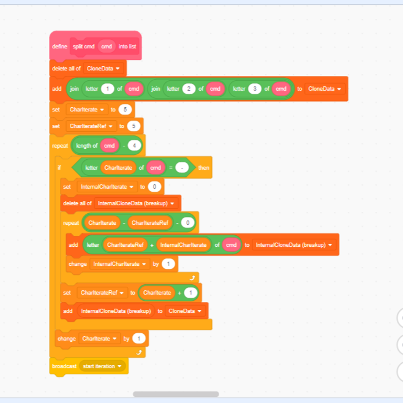

My interests in software engineering.

## How I got into it
“Okay Micaiah, your hour of video games for the day is up! Put the ipad down!” My mom’s words echoed inside of my ears like a piercing alarm bell. That was the worst thing I’ve heard all day! I was finally past level 2000 in Candy Crush, ready to unlock the mysteries of Tiffi and the land of candies, however here was my mom preventing me from doing so. My adventures would have to wait til the next day. As I played with these thoughts in my mind, I said what any 7th grader would say:

“But mom, I want to play more!”

“If you want to play more, create your own games and play them.” What my mom just said was a catalyst that would launch me into an entirely new hobby I’ve never considered. From that day on, I started to tinker with Scratch, a block-based programming language. My journey with Scratch itself is a long story of its own, but after about a year, I was curious about real-world programming. Sure, Scratch was great as it was super simple, but as I moved onto more complicated projects, Scratch had its limitations. 

_An implementation of the JavaScript `split()` function in Scratch. As you can see, something that can be done in a single command in JavaScript took many blocks to achieve in Scratch._  

That was when I decided to shift to website development, and I started by taking DevLeague’s basic software engineering class. This class covered introductory HTML, CSS, and JavaScript, and covered enough material for me to be able to create a fully functional static web application by the end of the course. This was indeed much more satisfying than coding video games on Scratch, as I knew that people could view these web applications.

## Technical interests

Since then, I’ve always been interested in any type of software engineering. I was pretty curious about the different ways people created these web applications, so driven by my curiosity I taught myself basic React, and MongoDB using FreeCodeCamp and YouTube tutorials. This helped to add an entire new layer to my web applications, as I could now create account systems and website statistics that can be stored (and won’t be erased upon refreshing the page). As of now, I’m interested in other ways to develop web applications, such as using Angular, SQL, or PHP. As I get more comfortable with the wide range of programming languages / libraries / frameworks, I hope to be able to pick out a “favorite” language or stack to develop web applications.

I’m also fascinated by software engineering for operating systems, and not just for the web. Taking ICS 212 last semester, which a deep dive into C and C++, made me appreciate how low-level programming languages work and can have a direct impact on the computer’s RAM. Thus, I’d like to develop some skills for non web-based software development as well. Some programming languages I would like to learn further are Python and C++. I know the basics of these languages, but reading articles on how powerful these languages are makes me want to learn more about them and use them for my personal projects.

## Teamwork 

Finally, I’m looking forward to the importance of collaboration and teamwork in software engineering. I enjoy how this class is so focused on working with other classmates, as it gives me a chance to get to know them. I’ve found it difficult to get to know my classmates in past classes due to there being no assignments to collaborate on. Thus, the fact that software engineering forces everyone to work together makes it “unawkward” to try to get to my classmates better, and I’m excited for this. I’m also interested in collaborating with my group members on a final software project to learn different methodologies of software development, such as using version control (like GitHub). Learning from my classmates is also a valuable experience, and I look forward to what my group members can bring to the table. As most ICS classes’ assignments have been individual, software engineering gives me a chance to make connections / bond with my other classmates through our passion for computer science.
