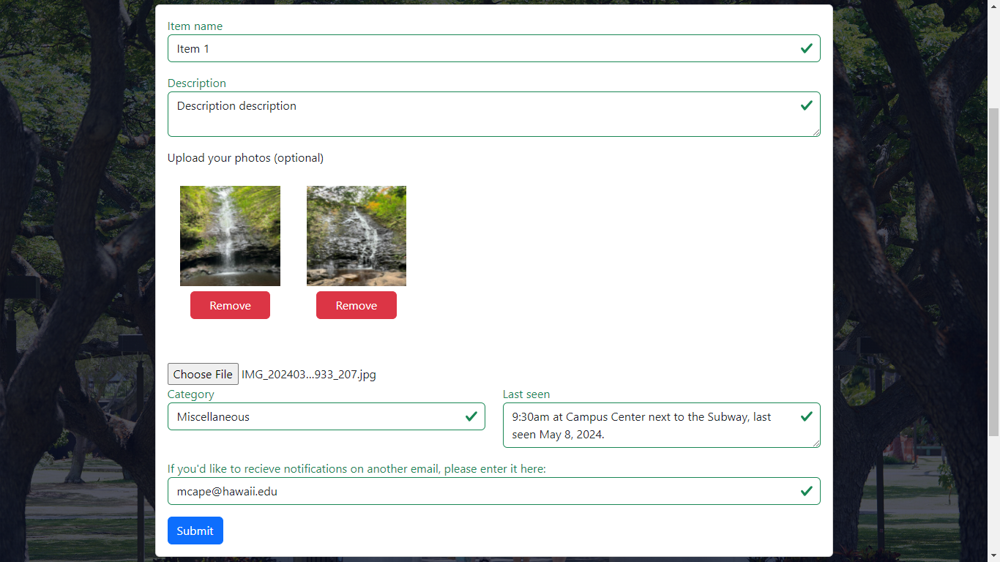
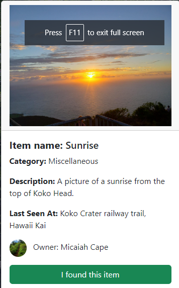
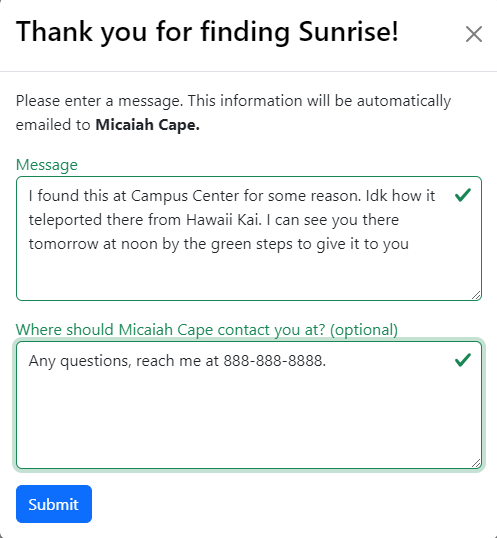
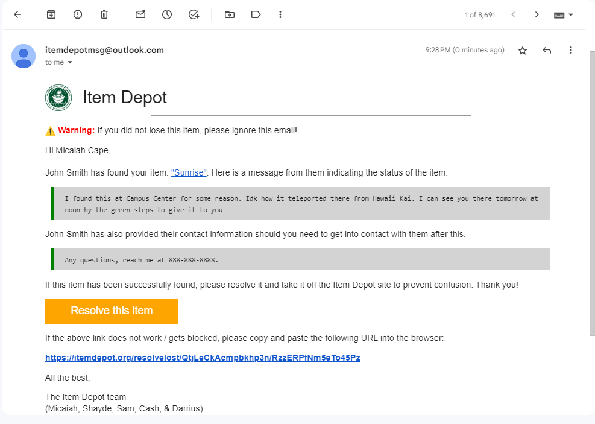
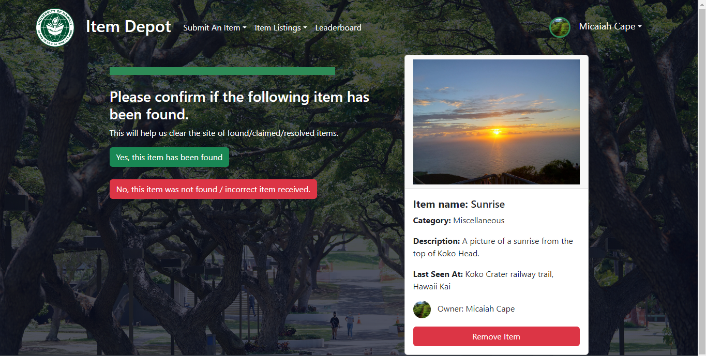

# About

This is a fullstack website that allows students to post information about items that they may have been lost on campus. Site visitors can view what has been lost on campus, and can aid in finding them. Students can also post images of items that they randomly come across on campus, and other site visitors can claim them. 

You can view the site here: [https://itemdepot.org](https://itemdepot.org/)

When a user has found a lost item, they can click a button on the associated item, fill out a form about the lost item's status (e.g. I have the <lost item> with me, catch me on <this day> on <this time> and I can give it to you.) Similarly, when a user wants to claim a item that has been formed item, they can click a button on the associated item, fill out a form regarding the item's status (e.g. I want to claim <this item> as it's mine.) The form's contents will automatically be emailed to the person who came across the item.

# How it works

This site was built using the [Meteor.js](https://meteor.com) framework, based off the [meteor-application-template-react template](https://github.com/ics-software-engineering/meteor-application-template-react). This template combines MongoDB and Node.js on the backend, and React.js on the frontend.

### Flow of lost items

Users can submit information about an item that they may have lost on campus. They can upload a description as well as multiple images (if applicable). Below is the schema for lost items.

```
this.schema = new SimpleSchema({
  itemName: String,
  image: Array,
  'image.$': String, // an array of unique image identifiers. Storing a list of raw metadata of an image in a single MongoDB document is excessive.
  owner: String, // who uploaded this item.
  category: {
    type: String,
    allowedValues: ['Electronics', 'Identification and Access Cards', 'Clothing and Accessories', 'Food and Drink Containers', 'Textbooks and School Supplies', 'Miscellaneous'],
    defaultValue: 'Miscellaneous',
  },
  description: String, // description
  dateReported: Date, // date that this item was reported
  lastSeen: String, // information on when and where this item was last seen
  contactEmail: String, // if users want email notifications about the status of this item, they can fill out this field.
});

The image of the lost item form is below, as well as an image of a Card that displays the lost item.
```

<br>
Lost item form that users can fill out.
<br><br>


<br>
An example card showing all the information that the user submits.
<br><br>

When another visitor has found the item, they can click the green "I found this item" button, and a form asking for the visitor's comment and contact information (optional) pops out. After the visitor submits the form, an automated email gets sent to the person who originally lost the item. The contents of the email are as follows:

 - The item that was lost
 - Any information that the finder left about the status of the item, or their contact information
 - A button that takes you to back to the Item Depot site to "resolve" the item (take it off the site to prevent confusion).

<br>
Contact form that the finder fills out.
<br><br>
<br>
Email that Micaiah Cape, the person who lost the item, receives when the contact form is filled out.
<br><br>

When the user presses the orange button, they get redirected back to the Item Depot site and they get asked whether the item has actually been found. If "yes" is clicked, the item is taken off the list of lost items and placed in the archive. Points are awarded to the finder as a way to gamify the app.

<br>
Users can confirm whether the item has been found by following the link in the email.
<br><br>

### Flow of found items

Very similar to the flow of lost items; however users can post images and information of items that they randomly found on campus (e.g. accidentally stumbled upon a white earbud when walking to class). People can claim it by clicking the green button on the card, and similarly to the lost items, the person who claims it must fill out a contact form (has the same fields as the lost items contact form). An email gets sent, and the person who originally posted the item can confirm whether someone actually physically claimed the item that they posted. The schema for found items is the same as the schema for lost items.

### Image uploading

Users can upload images no greater than 4mb for their profile picture, and they can upload images of up to 8mb for their item. The Image schema is as follows:

```
this.schema = new SimpleSchema({
  owner: String,
  data: String, // base64 encoded info for the image
});
```

The `_id` of each image is used to link the image to its lost / found item. The `data` field is an extremely long `string` that is stored in the mongodb database. It is read as is and rendered on the page. The string may look something like:
`data:image/jpeg;base64,/9j/<garble of letters here>`

### Profiles

When users sign up for the application, they are required to fill out some information, such as their first & last name, profile picture (default pic if blank), contact email, and position within the university (e.g. junior, senior, graduate student, staff, etc...). The schema for the profile is shown below.

```
this.schema = new SimpleSchema({
  firstName: String,
  lastName: String,
  email: String, // unique identifier to match with the default profile.
  image: { type: String, required: false },
  points: Number, // leaderboard points
  totalItemsFound: Number, // total number of items that the person found. NOT USED IN CURRENT VERSION
  totalItemsLost: Number, // total number of items that the person lost. NOT USED IN CURRENT VERSION
  recentItemsFound: { type: Array }, // NOT USED IN CURRENT VERSION
  'recentItemsFound.$': { type: String }, // an array of unique String identifiers. NOT USED IN CURRENT VERSION
  position: {
    type: String,
    allowedValues: ['Freshman', 'Sophomore', 'Junior', 'Senior', 'Graduate Student', 'Professor/Faculty', 'Staff', 'Other', 'Rather not say'],
    defaultValue: 'Other',
  },
});
```
The many different fields of the schema, such as `email`, `points`, and `firstName` all interact with the flow of lost / found items, making the entire process streamlined.

# Challenges
**Image uploading**. This was my first project I created where users can upload their own image and store it into a database. I initially looked into GridFS to accomplish this, but it seemed very complicated. Thus, I opted for the simpler solution of storing the encoded version of the images as a `String` inside the MongoDB database. The code that reads the image data is as follows:

```
function previewImage(e) {
    const src = URL.createObjectURL(e.target.files[0]);
    const size = e.target.files[0].size;
    const fr = new FileReader();
    fr.addEventListener('load', (event) => {
        const text = event.target.result;
        // check the image size.
        if (size >= 4194304) {
            // If more than 4mb, reject and display err message.
            swal('Please upload a smaller image!', `Max image size is 4mb; you've uploaded ${(size / 1048576).toFixed(2)}mb`, 'error');
            setUploadedImage('');
        } else {
            // If under 4mb, allow.
            setEncodedBinaryImage(text.toString());
        }
    });
    fr.readAsDataURL(e.target.files[0]);
    setUploadedImage(src);
}
```
where `e` is the element containing the file input.

**Automated email handling.** I was thinking of using Nodemailer for this, however this did not work. It took me a while to figure out, but I learned how to use the [Meteor email API](https://docs.meteor.com/api/email), and incorporate the important email string into an environment variable.
