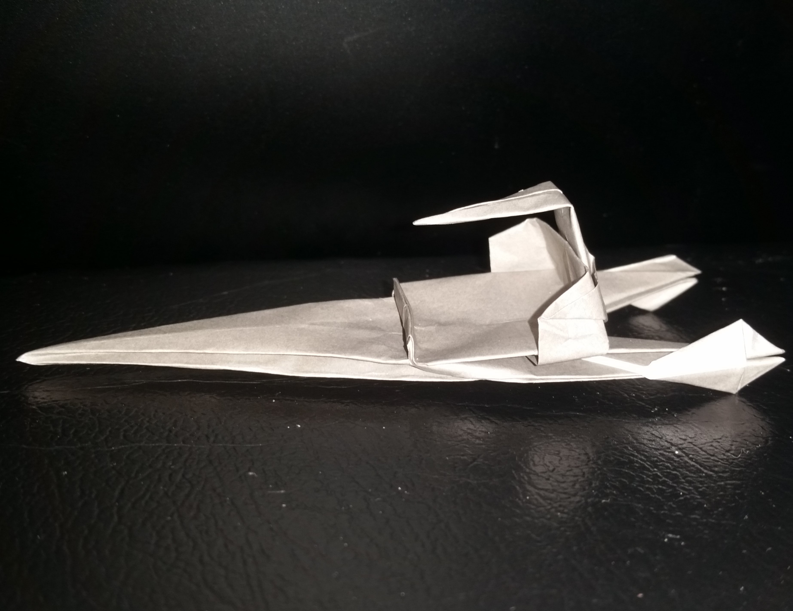
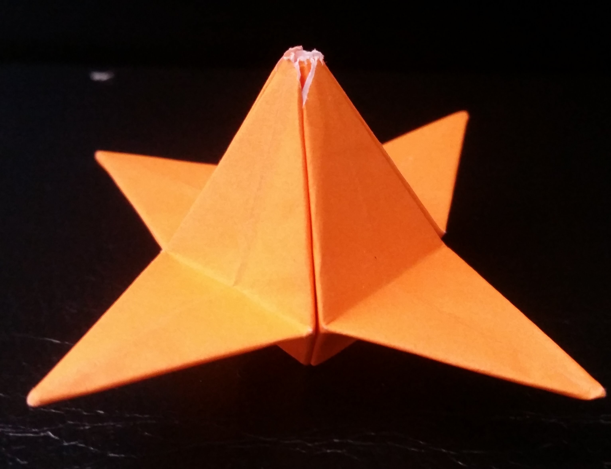
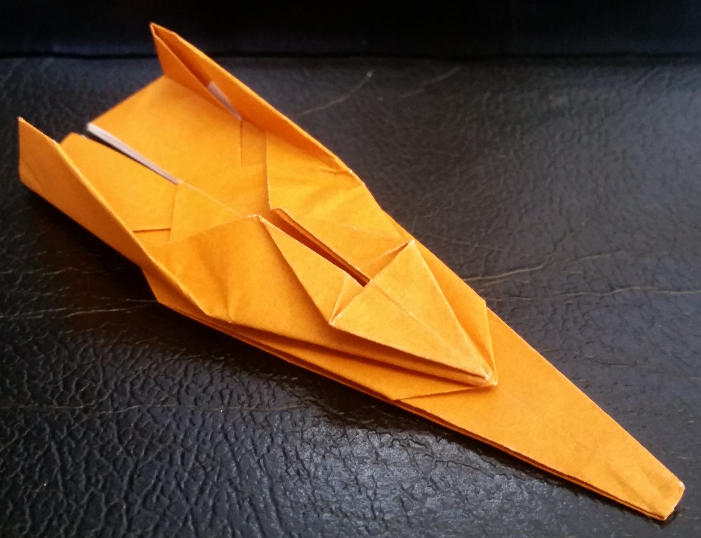
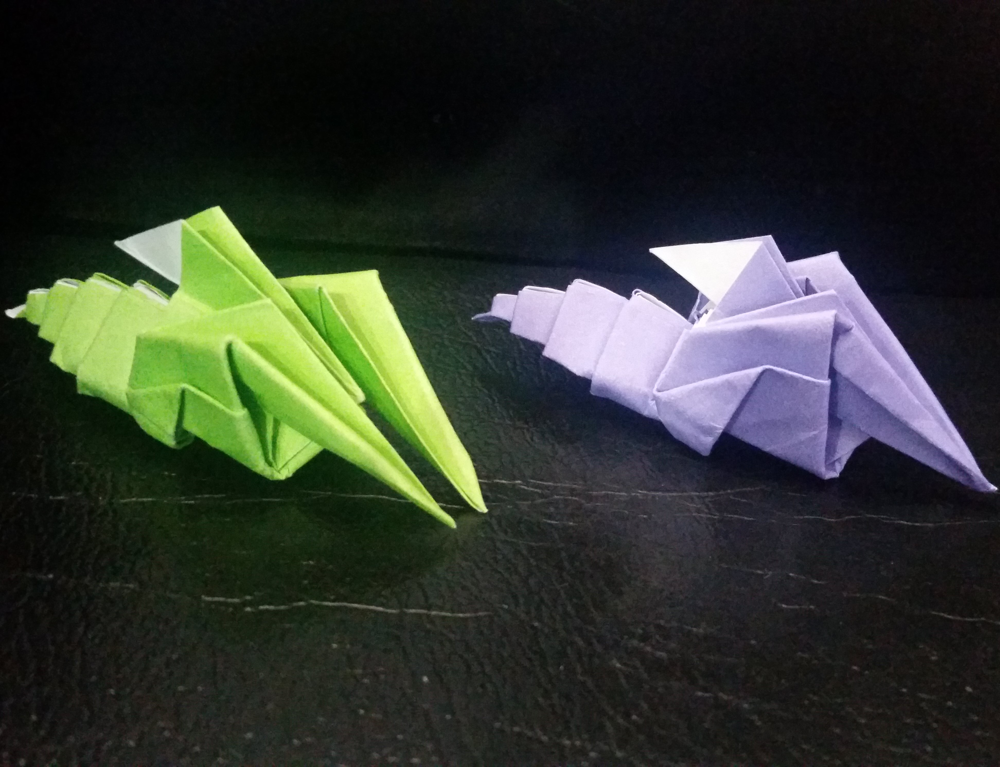

## About

This is a static, responsive website that hosts instructions to all my original origami models. I've created many different types of 2D or 3D models, such as futuristic vehicles, sea creatures, etc...

You can view the site here: [origamitician.github.io](https://origamitician.github.io/)

## Technical details

Before creating, I've realized that a lot of the code was going to be repetitive. Because every "subpage" (which was an individual page for my instructions) was going to be the same layout for every model, I had to think. Creating a new file and copying and pasting template HTML into that file was going to be a nightmare as if I wanted to change the layout of one page, I'd have to do this for however many subpages I created. This was made prior to knowing React, so I came up with an alternate solution: create a single JavaScript file `listOfSubpages.js` and create an array of objects. Each object contained relevant data for each model. For example, this was one object in a list of many different objects (You could actually view the entire list (here)[https://origamitician.github.io/models/js/listofsubpages.js]):

```
{
pageName: 'Sea Shrimp',
webLink: 'sea-shrimp.html',
shortDescription: 'A small shrimp, complete with two front claws and its distinguishable flexible tail.',
detailedDescription: 'This is one of the more recent models that I came up with. Featuring two front claws and a flexible tail, this shrimp is intricate yet easy to fold. This is a model that was sort of inspired by the Attacker Fish model.',
difficulty: 5.5,
time: '10-14 min',
image: 'https://pitchk.github.io/h/shrimp.jpg',
instructions: 'https://pitchk.github.io/sea-shrimp/shrimp.svg',
download: 'https://pitchk.github.io/sea-shrimp/shrimp.pdf',
images: [
  {url: 'https://pitchk.github.io/sea-shrimp/shrimptop.jpg', caption: 'Top View.'},
  {url: 'https://pitchk.github.io/sea-shrimp/twoshrimp.jpg', caption: 'Two shrimp, side by side.'}
]}
```

I then created a second JavaScript file `subpageGenerator.js` that rendered the UI using this object. `subpageGenerator.js` would have a single function `renderUI(index, similarModels)` where `index` would be a int indicating the index of the object within `listOfSubpages.js` where information is extracted from. `similarModels` would be an array of ints indicating the index of the object that has information similar to what's in `index`. Thus, the bottom of every HTML page would look like this:

```
<script src='js/subpagecreator.js'></script>
<script src="js/modeltemplate.js"></script>
<script src="js/listofsubpages.js"></script>
<script>
    createSubPage(7, [2, 3]); // create page with information from object index #7 from listOfSubpages.js. Link object #2 and #3 as "similar models" on this page.
</script>
```

Looking back on it, this could have been easily achieved with React.js; however I did not know it at the time. This project, however, did play a part in motivating me to learn React.js, should I design something similar in the future.

## Some models

I used Inkscape, a drawing software, to create the instruction diagrams. Here are some of the models I'm the most proud of:

<br>
Similar to the **Landspeeder** in **Star Wars**.
<br><br>
<br>
Flower
<br><br>
<br>
Another hovering vehicle.
<br><br>
<br>
Shrimp
<br><br>
