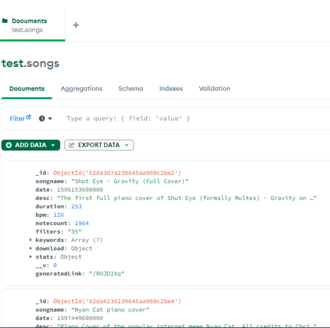
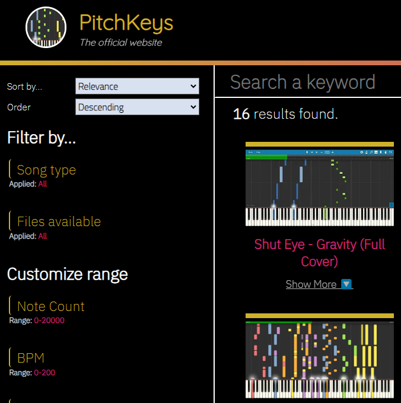

## About

This is a fullstack, responsive website that allows visitors to my YouTube channel to download the music I create. Users can sort and filter songs by keyword, bpm, genre, duration, rating, artist, etc..., and can also submit ratings for the songs. This is the first fullstack web application I created.

You can view the site here: [pitchkeys.github.io](https://pitchkeys.github.io/)

More specifically, users can download the mp3, MIDI, the MuseScore file (to edit MIDI), or the sheet music (if applicable) of each song.

## Technical Details

While creating this site, I learned the basics of React.js to build the UI, and was able to implement what I learned about basic backend development from [FreeCodeCamp](https://freecodecamp.org). All songs' info are stored in a MongoDB database, and I was successfully able to design a simple API using Express.js to retrieve the proper requested songs from the database. I ran into many different issues (such as linking frontend to backend, CORS headers, jittery React hooks, deployment), however this was an extremely valuable learning experience for me and I've figured out that fullstack development was my interest.

MongoDB document.
  

Song search page.
  
