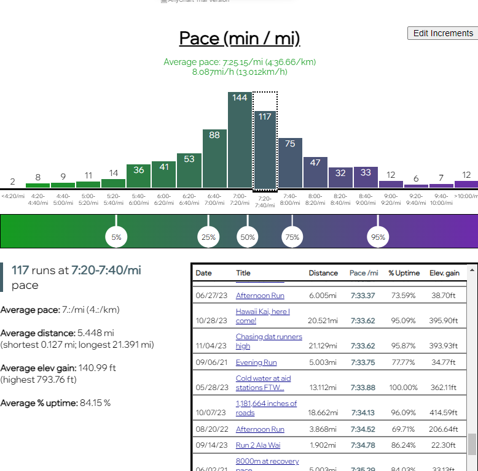
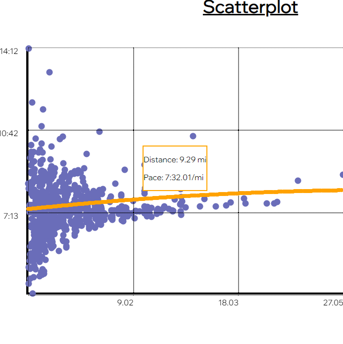
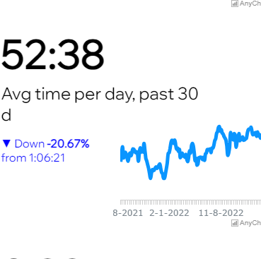

## How to use
Stravalytics is a web application that I built where users can analyze their running data in detail. When on the site, simply connect the "Connect to Strava" button to link your Strava accounts, and see your statistics via beautiful visualizations!

You can view the site here: [stravalytics.cyclic.cloud](https://stravalytics.cyclic.cloud/)

## How it works
A user connects their Strava account, and a call is made to the Strava API to retrieve all their activities. Once a user connects their Strava account, LocalStorage and MongoDB is used to keep them "logged in" to prevent them from having to connect their Strava account again (unless they decide to "logout" and disconnect it). When the API returns back the data, it is sorted and displayed in many different visualizations. Users can tinker with the numbers, such as displaying different variables, filtering displayed activities out by date, or changing the zoom on the visualizations.

## Stravalytics currently has the following visualizations:

* Histograms that sort your activities by pace, elevation gain, distance, and uptime.
  

* An interactive scatterplot that allows you to analyze relationship between many different variables, such as cadence, stride length, distance, heart rate, elevation gain, etc...
  

* Totals, averages, and moving averages of most run statistics, visualized by line graphs!
  

* Analyzing a single week, month, or year's worth of activities in detail (coming soon)

## Challenges
* As the UI got more complicated, there were more graphs to render upon every refresh (especially the anychart.js line graphs take a relatively long time to render compared to using the DOM.) I'm still working on resolving this issue - on a laptop it can take up to only 1 second to re-render the whole UI; however on lowend devices like my phone it takes up to 4 seconds, which is very noticable.
* Integrating the Strava API into my application. Documentation online was limited and was confusing to some degree, which forced me to look up YouTube tutorials on how to do it. After several nights, I as finally able to make the first Strava API call using this application. A few more nights of tinkering and I successfully was able to make it so that all users can connect their Strava account and view their statistics.
* Deployment. I used [Cyclic.sh](https://cyclic.sh), which is a free, quick hosting service. This was the very first time both my API and my frontend were in a single project (the previously mentioned [PitchKeys website](https://pitchkeys.github.io) actually used an external API that I deployed separately). Thus, I needed to work around a lot of error messages during deployment.

