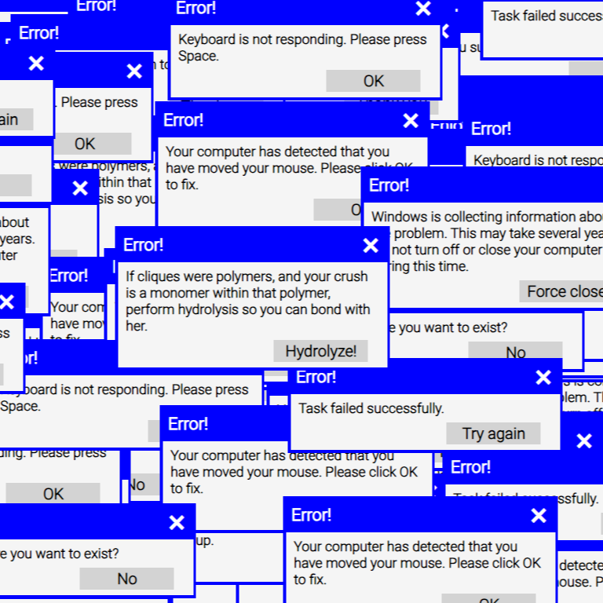

This is a project made for fun to for some trolling. **~~Pro Tip: SET YOUR VOLUME TO MAX!!!~~** I accept no responsibility for any blown-out speakers (or eardrums).

You can view the site here: [origamitician.github.io/notavirus1](https://origamitician.github.io/)

This site uses DOM manipulation to clone fake virus windows. Some windows may have a rickroll autoplay, other windows may play the Fim Derp Theme from My Little Pony at max volume, and some windows might make you question your existence. Simply press one of the buttons on the blue generated windows to end the chaos (that's if, the other generated windows don't get in the way...)
